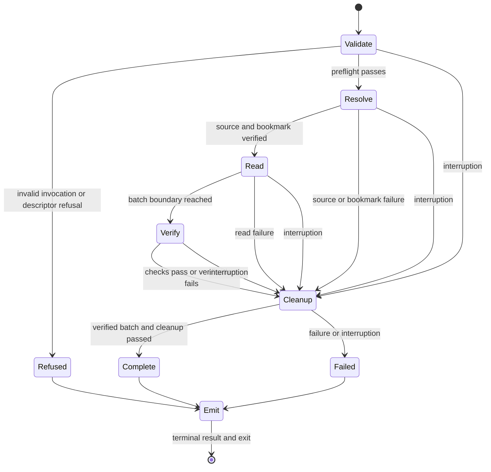

# RFC-03: Native transcript retrieval

## Abstract

HCN consumers need to inspect saved messages and tool results without asking a model to continue a conversation. This RFC adds passive native transcript reads through one JSONL CLI contract, with original records beside normalized fields. Reads cover one caller-identified native conversation, support verified caller-held bookmarks, and report each harness's actual coverage and limits. Consumers retain responsibility for indexing, retention, search, watching, and presentation. This document is a Draft and does not authorize implementation.

## Introduction

Trevor planning exposed a difference between native resume history and an inspectable transcript. The HCN checkout examined at the start of planning exposes resume and live-session operations but no unified saved-transcript read operation. Existing research found native read methods with different coverage: some return current model context or processed history, some expose retained entries, and some selected-version behavior remains unverified.

The [planning map](https://github.com/dungle-scrubs/harness-cli-normalizer/issues/154) records the decisions. Kevin confirmed the conversation, record, and incremental semantics through a live discussion, then instructed the driving session to take its remaining recommendations. The capability/ownership and custom-harness resolutions identify those machine-made choices. This RFC renders that contract into concrete wire fields and validation requirements under the same authority.

The proposed ownership boundary places native transcript retrieval in HCN because it normalizes harness differences without maintaining cross-call application state. This adds a CLI capability within the normalization purpose in [CONTEXT.md](../../CONTEXT.md) and [ADR 0007](../adr/0007-narrow-scope-one-process-at-a-time.md). It does not add a supported library import surface.

In scope: Claude, Codex, Pi, and Muse source-specific capability reports; passive reads of one native conversation; native objects and normalized fields; retained branches; explicit coverage; bounded batches; bookmarks; and compatible customized Pi behavior. A method can report unknown or unavailable support rather than claiming parity.

Out of scope: discovering/listing conversations; HCN transcript storage or indexes; retention, search, watchers, retries, and acknowledgements across calls; human-readable exports; automatically reading external attachments or separate child/forked conversations; reconstructing deleted data; registering or integrating a new harness; and changing Trevor's ownership or harness choices. Model requests and changes to saved history are prohibited. RFC acceptance, implementation, release, and publication remain distinct steps.

### Fit of this revision

The users are Kevin through consumers such as Trevor, which inspect saved messages and tool results. HCN normalizes harness interfaces and supervises the processes it starts. Exact wire fields, source-resolution rules, evidence-qualified coverage, and failure handling serve that existing proposal and **hold** its scope. The revision carries the HCN skill-update requirement into the delivery contract. It adds no supported library import surface.

Review suggestions do not extend the feature to universal bookmark portability, protection against an arbitrary consumer's lossy JSON parser, or a persistent signing/key service: those would add guarantees or services outside this passive normalization contract. Cross-method continuation requires explicit verified compatibility, and consumers preserving originals use a lossless parser. New harness registration, indexing, retention, search, and Trevor ownership remain outside this proposal.

## Terminology

The key words MUST, MUST NOT, REQUIRED, SHALL, SHALL NOT, SHOULD, SHOULD NOT, RECOMMENDED, MAY, and OPTIONAL in this document are to be interpreted as described in RFC 2119.

| Term | Meaning |
| --- | --- |
| Native conversation | A conversation identified by the harness. It can span several native files. It is distinct from HCN's live session process and a consumer's ID. |
| Retained history | Records still available in the native source, including retained branches and pre-compaction records. It is not a claim that everything originally said survived. |
| Current context | Messages currently prepared for the model. It can omit retained history. |
| Native entry | One entry in the selected native source. Headers that describe a file are source metadata. |
| Original record | The complete native entry object, with unknown fields and JSON values preserved. Exact whitespace and file formatting are not preserved. An API projection is labelled separately. |
| Source position | A record location scoped to an identified source and verified history. A Position is distinct from a caller-held bookmark and is not a permanent native ID. |
| Bookmark | Opaque caller-held progress and validation evidence for a later read. HCN stores no associated cross-call state. |
| Batch | Whole native entries returned by one finite read, followed by a final result. |
| Coverage limit | A named retrieval guarantee that the caller explicitly permits the read to reduce. |
| Divergence | A capability the selected source/read method cannot express, reported instead of fabricated. Unknown evidence is distinct from known divergence. |
| Verified batch | A batch whose identity, prefix continuity when applicable, and source consistency pass the selected method's checks. |

## Protocol Overview

### CLI and source selection

```text
hcn inspect <harness> --transcript
hcn transcript read <harness> (--id <native-id> | --file <path>)
Optional read arguments: --cwd <directory>, --since <bookmark>,
  --limit <positive-entry-count>,
  --accept-limits <history,branches,original-records,embedded-content>
```

The harness names are `claude`, `codex`, `pi`, and `muse`. A read requires exactly one selector. An ID is a native conversation ID, not an HCN process handle or consumer ID. A file selects a native conversation through its validated source metadata; it does not restrict the read to that one file when the native conversation spans files. HCN MUST NOT create or resume a conversation when lookup fails.

The resolution workspace is the absolute `--cwd` directory, or the invocation's working directory when omitted. Relative file paths resolve against that workspace. For ID selection, each method declares an `idResolutionRuleId`: the verified native namespace and location rules, including whether lookup is workspace-scoped or user-scoped, which native location settings it honors, and its exact lookup algorithm. Resolution uses that rule, the resolution workspace, and the caller's native home/store-location settings. It MUST NOT search outside the declared namespace or treat an ID match in a different namespace as a substitute. Multiple distinct matching conversations fail with `source-ambiguous`; an observed identity inconsistent with the selected conversation fails with `source-identity-mismatch`.

Rules for location settings are native-format facts to verify, not a promise that existing resume-store helpers already honor every native setting. An unverified ID lookup remains unavailable or unknown; a verified file method can still be used through `--file`. No new store-root override or conversation-list operation is added. The selected workspace and lookup roots are reported in `selection`; these describe resolution and are not permission grants.

Inspection opens no history and starts no native process. It emits one capability document on success or one `transcript-inspection-error` object on a recognized invalid transcript-inspection request. `--transcript` excludes other inspection modes. Ordinary help/version behavior is unchanged. Transcript reads reject prompt, model, tool-grant, extension, discovery, system-prompt, and native-passthrough arguments. HCN run defaults MUST NOT launch model work, load user instructions, or select a different conversation during a transcript operation.

A read emits UTF-8 JSONL on stdout, without needing `--json`; saving stdout is the export. Diagnostics go to stderr. `--limit` is a positive integer no greater than 9007199254740991, counting complete native entries, not headers or envelopes. With no limit, read to the call's fixed boundary. A limit is neither a byte limit nor a bound on internal validation work. Whole entries MUST remain intact. `paging` means this bounded-batch behavior; it does not by itself promise a usable continuation bookmark.

### Coverage, history, and files

The four guarantee names are **`history`, `branches`, `original-records`, and `embedded-content` everywhere**, including flags, capabilities, coverage, limits, and errors. Every read requests complete coverage for all four. The meanings are:

| Guarantee | Complete means |
| --- | --- |
| `history` | All entries currently retained for the selected conversation are accessible through the method, including retained pre-compaction entries. A batch can return only part of that accessible history. |
| `branches` | All currently retained branches are included in that accessible history, with native links preserved; this says nothing about live branch selection. |
| `original-records` | Complete native saved entries and native headers are preserved, including unknown fields, rather than only a processed API projection. |
| `embedded-content` | All content stored inside the selected native entries is preserved, including large tool results and non-text data. |

A coverage assessment describes the accessible view at the call's boundary, not how many entries the batch returned. `more` and `incompleteTail` describe that batch separately. Historical events the harness deleted or never saved are reported under `historicalLoss`, never as an unaccepted retrieval reduction. A complete retained-history read can therefore succeed while `historicalLoss.state` is `known-loss` or `unknown`. Absence of a known loss is not evidence of `none-established`.

`--accept-limits` names only the four guarantees above; duplicates are deduplicated and `all` is invalid. It permits a guarantee to be `limited` or `unknown`; it does not turn unknown coverage into a known gap. Without the relevant opt-in, either state prevents success. Accepted limits MUST NOT discard safely available data. Select a verified method meeting all requested guarantees when one exists. Otherwise select the method with the fewest actual limited/unknown guarantees allowed by the caller, with ties broken by the descriptor's documented preference order. Never prefer current context merely for convenience when a fuller passive method is available. No method can waive passivity, identity, format integrity, value preservation, consistent batches, or bookmark validity.

Native persistence segments and native headers are conversation storage. A separately persisted tool-result entry is also conversation storage when the verified format makes it an entry of that conversation. Read those storage units and preserve each entry; do not merge entries. A pathname or URL in an entry that points to an attachment or external payload remains a reference, even if the native harness wrote that file. Such a reference does not authorize dereferencing it. If a format does not establish which category a file belongs to, report the relevant coverage as unknown rather than assuming completeness. Embedded tool-result text cannot be silently shortened; a persisted truncated value stays intact and known prior truncation is historical loss. This distinction preserves the agreed external-file boundary.

Saved order comes from the verified native ordering rule, including segment ordering where applicable. Timestamp sorting and guessed branch order are prohibited. Separate child or forked conversations remain references. Failure to establish an ordering needed by the method is a format/consistency failure, not permission to invent one.

## Message Formats

### Schema conventions and value preservation

The following tables are the normative schema. Each named object requires all fields listed in its table; added optional fields are permitted under Versioning. A named type refers to its table. `T or null` permits JSON null; it is forbidden elsewhere. Arrays are ordered JSON arrays; maps are JSON objects keyed exactly as stated. `string` means a JSON string. Protocol counts are nonnegative integers up to 9007199254740991. Unbounded native offsets and numeric native identifiers use decimal strings. Every enum explicitly listed here is closed in schema version 1. Opaque identifiers are strings, not enums.

Each read envelope has `schemaVersion: 1` and `kind`. Exactly one `source`, zero or more `record` objects, and one terminal `result` form a complete stream. Each object occupies one LF-terminated JSON line. No envelope follows a result. A recognized invalid read still emits source and result envelopes with the unknown values specified below when stdout is writable. No successful result means no successful batch, regardless of how many records arrived.

`original` and native header `original` fields retain native JSON values. Object key order, whitespace, escape spelling, and number spelling are not preserved. Strings preserve their decoded sequence of Unicode code units, including lone surrogate escapes; invalid UTF-8 is rejected. Arrays preserve order. Objects with duplicate decoded member names fail `source-malformed` rather than silently choosing a value. Numbers compare as exact finite decimal mathematical values: `1`, `1.0`, and `1e0` are equal; `-0` and `0` are equal. Boolean, string, null, array, and object types remain distinct. A native number cannot be replaced by a JSON string and called preserved.

HCN MUST parse and emit native numbers without precision loss, using a lossless parser/emitter or equivalent verified mechanism. The wire remains ordinary JSON, including numeric tokens larger than an IEEE-754 safe integer. Consumers that preserve originals MUST use an exact-number parser or retain their original JSON text; ordinary JavaScript number parsing alone does not meet that consumer requirement. HCN does not promise to repair a consumer's lossy parser. Example: native `9007199254740993` stays that numeric value on the wire; a consumer that observes `9007199254740992` lost precision.

### Shared vocabulary

`Harness` is the closed set claude, codex, pi, muse. `Guarantee` is the closed set of four names in Coverage, with canonical order history, branches, original-records, embedded-content. `CapabilityName` appends `active-branch`, `incremental`, `paging`, and `record-identity` in that order. This also defines canonical capability order. A `CapabilityMap` has all eight keys and a `Capability` value for each. A `CoverageMap` has exactly the four guarantee keys and an `Assessment` for each. Neither map uses camelCase aliases.

| Object | Required fields and types |
| --- | --- |
| `Build` | `version`: string or null; `buildId`: string or null. Null means not established, never the HCN version substituted for a native version. |
| `Applicability` | `formatId`: string or null; `formatVersions`: array of strings; `writerBuilds`: array of Build; `readerBuilds`: array of Build; `scope`: string. Empty lists mean unspecified, not all versions/builds. `scope` states the tested or documented conditions. |
| `Evidence` | `standing`: `documented`, `observed`, or `unknown`; `reference`: string or null; `appliesTo`: Applicability. Known evidence requires a reference to public documentation, pinned source, or reproducible synthetic verification. |
| `Capability` | `status`: `available`, `limited`, `unavailable`, or `unknown`; `reason`: string; `evidence`: array of Evidence; `prerequisiteRuleIds`: array of strings. An empty evidence list requires unknown status. |
| `Assessment` | `state`: `complete`, `limited`, `unknown`, or `not-applicable`; `reason`: string; `evidence`: array of Evidence. A known complete view with no embedded payloads uses complete with a reason, not not-applicable. |
| `Limit` | `guarantee`: Guarantee; `accepted`: boolean; `requested`: literal `complete`; `available`: Assessment; `returned`: Assessment. It states the accessible view and the actual returned projection separately. |
| `HistoricalLoss` | `state`: `known-loss`, `none-established`, or `unknown`; `details`: array of LossDetail; `evidence`: array of Evidence. None-established requires positive source evidence for the claim's stated scope; unknown is the default. |
| `LossDetail` | `kind`: `deleted`, `not-persisted`, `truncated`, or `other`; `description`: string; `reference`: Reference or null. Known-loss requires at least one detail. No reconstruction is implied. |
| `Rule` | `id`: string; `purpose`: `resolution`, `compatibility`, `passivity`, `ordering`, `normalization`, `consistency`, or `continuation`; `description`: string; `appliesTo`: Applicability; `evidence`: array of Evidence. The referenced documentation/test MUST specify an actionable algorithm and preconditions; a rule ID alone is not proof. |

`not-applicable` coverage is reserved for guarantees that could not be evaluated because no usable source was resolved. All four assessments on a complete result are complete, limited, or unknown. `limits` has exactly one entry for each limited/unknown returned guarantee and no others, in guarantee-name order. Accepted permission alone creates no Limit. Failed results retain observed assessments and use unknown for the unobserved remainder. Thus `returned.state: unknown` does not pretend that an unsuccessful partial stream established coverage.

### Capability document and inspection errors

| Field | Required type or value |
| --- | --- |
| `schemaVersion`, `kind` | `1`, `transcript-capabilities` |
| `harness`, `hcnVersion`, `verifiedAgainst` | Harness name; HCN version string; descriptor verification version string or null |
| `sourceFormats` | Array of SourceFormat |
| `methods` | Array of Method |
| `rules` | Array of Rule, with unique IDs |
| `capabilities` | CapabilityMap |

| Object | Required fields and types |
| --- | --- |
| `SourceFormat` | `id`: string; `versions`: array of strings; `description`: string; `evidence`: array of Evidence. The ID is an HCN format identifier, not a native conversation ID. |
| `Method` | `id`: string; `transport`: `file`, `api`, or `export-process`; `formatIds`: array of strings; `selectors`: array drawn from `id`, `file`; `idResolutionRuleId`: string or null; `preference`: protocol count; `passivity`: Capability; `capabilities`: CapabilityMap; `incrementalStrategy`: `native`, `revalidate-prefix`, `none`, or `unknown`; `identityKinds`: array drawn from `native-id`, `source-position`; `ruleIds`: array of strings; `bookmarkCompatibility`: array of BookmarkCompatibility; `cleanupTimeoutMs`: positive protocol count |
| `BookmarkCompatibility` | `fromMethodId`: string; `fromBookmarkVersion`: positive protocol count; `toMethodId`: string; `ruleId`: string. This is the explicit cross-method/encoding compatibility declaration. |

Method, format, and rule IDs are opaque, nonempty ASCII strings matching `[a-z0-9][a-z0-9._-]*`, unique in their harness descriptor. They are not closed enums: callers enumerate them from inspection and do not invent them. An enabled method requires referenced resolution where applicable, compatibility, passivity, ordering, normalization, and consistency rules. Incremental methods additionally require continuation rules. Each referenced ID MUST resolve in the capability document; each declared format ID resolves in sourceFormats. Preference is lowest-first and unique among methods. cleanupTimeoutMs bounds catchable cleanup and native termination escalation; passivity rules specify those steps. This is immutable HCN knowledge, not a caller registration interface.

Per-method capabilities describe a single method. Top-level capabilities report the best established status per capability across methods, with the reason identifying conditions; they do not imply one method provides every best status simultaneously. Available ranks above limited, then unknown, then unavailable. No methods yields unknown unless evidence establishes unavailable. For a native process, passivity is available only for verified lifecycle/build conditions. Documentation evidence stays documented; it is never promoted to observed by successful file lookup.

A recognized transcript inspection error has exactly `schemaVersion: 1`, `kind: "transcript-inspection-error"`, `harness` (Harness or null), `hcnVersion` (string), `exitCode: 2`, and `failure` (Failure). It uses an input issue, phase validate, no source position, and no native exit code. Unknown harness selection uses null. Ordinary inspection without `--transcript` is unchanged.

### Source envelope

| Field | Required type or value |
| --- | --- |
| `schemaVersion`, `kind` | `1`, `source` |
| `harness`, `hcnVersion` | Harness or null before valid selection; HCN version string |
| `conversation` | Conversation or null before identity is established |
| `selection` | Selection |
| `sources` | Array of Source, unique key per source |
| `nativeHeaders` | Array of Header |
| `methodId` | String or null before method selection |
| `readerBuild` | Build or null when no native reader runs or before discovery |
| `verification` | Array of Evidence identifying the method/format/build claims actually relied on |
| `appliedRuleIds` | Array of strings referring to the corresponding inspection document |
| `compatibility` | Compatibility |
| `requested`, `acceptedLimits` | Array of all four Guarantee names; array of accepted Guarantee names, both in canonical guarantee-name order |
| `capabilities` | CapabilityMap for the selected method and known source facts |
| `coverage`, `historicalLoss` | CoverageMap; HistoricalLoss |

| Object | Required fields and types |
| --- | --- |
| `Conversation` | `nativeId`: string or null. A validated file can identify a conversation even when no native ID is present. |
| `Selection` | `kind`: `id`, `file`, or `unknown`; `value`: string or null; `workspace`: absolute path string or null; `storeRoots`: array of absolute path strings. Roots record the lookup scope actually used; file selection need not use store roots. No raw bookmark appears here. |
| `Source` | `key`: string; `kind`: `file`, `api-resource`, or `export-resource`; `nativeId`: string or null; `location`: string or null; `formatId`: string or null; `formatVersion`: string or null; `writerBuild`: Build. Location is the real source locator when known, not a temporary export path used as invented identity. |
| `Header` | `sourceKey`: string referring to Source.key; `original`: complete native JSON object. Source order then native header order determines this array's order. |
| `Compatibility` | `state`: `verified`, `unverified`, or `incompatible`; `ruleIds`: array of strings; `reason`: string; `evidence`: array of Evidence. Verified applies only to the selected method's stated format/lifecycle guarantees, not every harness operation. |

The source envelope contains all storage units and headers needed by the selected method's established view; method discovery/assembly precedes record emission. It is provisional: final source observations live in Result. If discovery later reveals an omitted required storage unit or changed source assembly, the batch fails rather than retroactively adding an undeclared source to emitted records. Known writer versions/builds are per source; native reader and HCN versions are separate fields. None replaces `verifiedAgainst` or the versions in Evidence.

Before source resolution, conversation and methodId can be null, sources/nativeHeaders/verification/appliedRuleIds are empty, compatibility is unverified, all capabilities are unknown, coverage is not-applicable with reasons, and historicalLoss is unknown. Selection carries only successfully parsed facts; invalid selection uses kind unknown and null value. Refusal does not fabricate headers, identity, or progress.

### Record envelope and references

| Field | Required type or value |
| --- | --- |
| `schemaVersion`, `kind` | `1`, `record` |
| `sourceKey` | String referring to Source.key, including when position is null |
| `nativeId` | Native entry ID string or null; no generated permanent ID |
| `position` | Position or null when the method cannot establish a position |
| `originalKind` | `saved-record` or `api-record` |
| `original` | Complete native entry JSON object |
| `normalized` | Normalized |

| Object | Required fields and types |
| --- | --- |
| `Position` | `sourceKey`: string; `unit`: `byte-offset`, `entry-index`, or `native-cursor`; `value`: string. Byte offsets are zero-based byte positions at the entry start; entry indexes are zero-based among non-header entries in that source. Their values are unsigned canonical decimal strings. Native cursors are opaque nonempty native strings at the identified entry, with interpretation fixed by the method. |
| `Normalized` | `kind`: `message`, `tool-result`, `compaction`, `branch-summary`, `metadata`, `custom`, or `unknown`; `role`: `user`, `assistant`, `system`, `tool`, `custom`, `unknown`, or null; `timestamp`: decimal Unix-seconds string or null; `parts`: array of Part; `relationships`: RelationshipMap |
| `Part` | `kind`: `text`, `thinking`, `tool-call`, `tool-result`, `image`, `audio`, `video`, `file-reference`, `custom`, or `unknown`; `originalPath`: JsonPath; `text`: string or null; `toolCallId`: string or null; `toolName`: string or null; `contentStatus`: `included`, `not-included`, or `unknown` |
| `Relation` | `state`: `known`, `none`, `unknown`, or `not-applicable`; `targets`: array of Reference; `basis`: `native-field`, `format-rule`, or `unknown`; `originalPaths`: array of JsonPath; `ruleId`: string or null |
| `Reference` | `kind`: `entry`, `tool-call`, or `conversation`; `scope`: ReferenceScope; `nativeId`: string or null; `position`: ReferencePosition or null |
| `ReferencePosition` | `unit` and `value`: same units and string rules as Position; source scope comes from Reference.scope. |
| `ReferenceScope` | `harness`: Harness or null; `conversationId`: string or null; `sourceKey`: string or null; `location`: string or null |

`JsonPath` is an array of object-key strings and nonnegative array-index integers, traversed from original. An empty array refers to original itself. It MUST resolve within that same object and never reads an external resource. `RelationshipMap` has exactly `parent-entry`, `tool-call`, `first-kept-entry`, `branch-origin`, and `parent-conversation`, each a Relation. Multiple established targets are allowed in one Relation. A known relation has at least one target and a known basis. None means a positively established absence, such as a native root; not-applicable means the relationship has no meaning for this entry kind. Unknown means insufficient evidence. None, unknown, and not-applicable have empty targets; none and not-applicable require a known basis. Unknown has unknown basis, empty originalPaths, and null ruleId. A format-rule basis requires ruleId; a native-field basis requires a nonempty originalPaths array and null ruleId. Each path identifies its native evidence; the array `[[]]` identifies the original object itself and is distinct from no paths. No proximity-based tool matching or inference from summary prose is allowed.

An entry Reference has a nativeId or position. A tool-call Reference has a nativeId containing the native call identifier and null position. A conversation Reference always has null position. If nativeId is non-null, scope.conversationId MUST equal it; scope.location can also be present when it identifies that same conversation. If nativeId is null, scope.conversationId MUST also be null and scope.location MUST be non-null. This second form is the location-only target. Known conversation IDs are not omitted in favor of location-only encoding. A Reference scope MUST identify the native conversation or a native source location/key sufficient under the format's rules; otherwise the relation remains unknown and the unresolved native value stays in original. A sourceKey refers to this stream's sources and cannot name an unopened parent conversation; such a target uses its own conversationId/location. A ReferencePosition is interpreted within that ReferenceScope, allowing a native location and offset to identify an external target without opening it. A record's non-null Position.sourceKey equals its envelope sourceKey. Reference native IDs are never HCN IDs. Relation order within targets follows native order.

There is one record per native entry. Native message parts stay in that record, in native content order. Parts identify native content blocks through originalPath; nested unnormalized values remain accessible in original. The method's normalization rule states its native mappings. Recognized text, tool IDs, and names MUST populate their named fields; absent or unrecognized values use null. Role is null for entries to which message/tool roles do not apply, and unknown when the source has a role that cannot be normalized. A timestamp is normalized only when its epoch and units are established; it is an exact signed decimal number of seconds since the Unix epoch, without exponent notation. Unrepresentable or unknown semantics use null. Timestamps never change saved order.

Included payloads use contentStatus included. An external reference uses not-included, without implying existence or accessibility. Unknown means the method cannot establish whether the native content value is embedded or a reference. In every case original retains the entire native value. A native export process can emit saved-record when it demonstrably preserves saved entries, or api-record when it emits a projection: transport does not determine originalKind. The same rule applies to an API that actually exposes complete saved entries. Missing native IDs or nullable positions are reported by record-identity capability; neither authorizes synthesized permanent IDs.

Source keys are location/reference keys scoped to the selected method and verified source history. Within the same method and unchanged source assembly, fresh reads use the same keys/positions; compatible appends and verified continuation MUST preserve them. A supplied bookmark carries any needed native source mapping for a caller-supplied relocation. If that mapping cannot be verified, return fresh-read-required. Positions from separate fresh reads are not proof of continuity; a consumer needs native identity plus established continuity before deduplicating across histories. A failed batch establishes neither position validity nor progress. Cross-method stability exists only under an explicit compatibility rule. No content hash becomes a native ID.

### Result envelope and observations

| Field | Required type or value |
| --- | --- |
| `schemaVersion`, `kind` | `1`, `result` |
| `status`, `exitCode` | `complete` and 0; `refused` and 2; or `failed` and 1 |
| `recordsReturned` | Protocol count of emitted complete record envelopes, including provisional ones before failure |
| `coverage`, `limits`, `historicalLoss` | CoverageMap; array of Limit; HistoricalLoss |
| `capabilities`, `compatibility`, `appliedRuleIds` | Final CapabilityMap; Compatibility; array of applied rule IDs |
| `more` | Boolean on complete; null when not established on failure/refusal |
| `incompleteTail` | IncompleteTail or null |
| `activeBranch` | BranchObservation |
| `consistency` | Consistency |
| `continuation` | Continuation |
| `bookmark` | Bookmark string or null |
| `failure` | Failure or null; null exactly on complete |

| Object | Required fields and types |
| --- | --- |
| `IncompleteTail` | `position`: Position; `reason`: string. It identifies the start of the excluded final unfinished entry. A method that cannot locate a tail cannot silently claim the tail exception. |
| `BranchObservation` | `state`: `known`, `unknown`, or `not-applicable`; `view`: `live`, `saved`, or `unknown`; `selection`: Reference or null; `evidence`: array of Evidence. Known requires a selection and known view. Unknown/not-applicable use null selection and unknown view. |
| `Consistency` | `method`: `native-snapshot`, `validated-prefix`, or `unknown`; `ruleIds`: array of strings; `boundaries`: array of Boundary; `checks`: array of Check; `assumptions`: array of strings |
| `Boundary` | `sourceKey`: string; `observedEntries`: unsigned decimal string or null; `progressEntries`: unsigned decimal string or null; `observedThrough`: Position or null; `progressThrough`: Position or null. Counts describe complete entries in the finite view and cumulative verified progress through that source, including input progress. Counts are required non-null on complete results. Positions identify their last entries when locatable; null with count zero means before the first entry, and null with a positive count means position unavailable. Positions refer to that same sourceKey. |
| `Check` | `ruleId`: string; `outcome`: `passed`, `failed`, or `unknown`; `description`: string. No transcript content or raw bookmark is included. |
| `Continuation` | `input`: `absent`, `verified`, `invalid`, or `not-checked`; `output`: `advanced`, `same-boundary`, or `unavailable` |

`more` compares returned progress to the complete entries in the fixed view; an unfinished tail alone does not make it true. Every source in the view has one Boundary in native source order. Every item in consistency.checks is a required check, not an informational notice. consistency.ruleIds identifies the method's required consistency rules and, for a supplied bookmark, its required continuation rules. Once selected for evaluation in Resolve, each of those rule IDs has exactly one Check, aggregating that rule's required source evaluations; ruleId sets match with no duplicate checks. Before evaluation its outcome is unknown. Informational observations belong in evidence or assumptions. A complete result requires verified compatibility, a known consistency method, all required checks present with outcome passed, and only accepted limited/unknown coverage. Unknown consistency is allowed only on unsuccessful results. Failed/refused results always have bookmark null and continuation.output unavailable, even if some emitted entries were complete.

For preflight refusal, recordsReturned is zero, more is null, incompleteTail is null, activeBranch is unknown, consistency has method unknown and empty ruleIds/boundaries/checks/assumptions, and continuation.input is absent or not-checked according to whether a bookmark was supplied. Coverage/source observations retain only facts already established. Malformed bookmark encoding is not-checked, not source-invalid. For every phase, continuation.input is absent when no bookmark was supplied. With a supplied bookmark it is not-checked until validation completes, verified when input continuity passes, or invalid when completed checks reject or cannot establish that continuity. Later findings that defeat the input continuity replace verified with invalid; a later unrelated read/output/cleanup failure leaves it verified. An interruption before a validation outcome leaves it not-checked. This reports the outcome established in this call, not a promise that the input remains valid on a future retry. A runtime-invalid bookmark uses input invalid. The result's capabilities, coverage, compatibility, and observations replace the source envelope's provisional values.

BranchObservation is an observed value, never a change event. A consumer can compare observations across successful reads. A zero-entry read still returns the available observation. A Pi file's verified reload-selection rule can establish a saved view; it cannot establish the running process's live selection. If neither view can be established, report unknown. A saved selection is not presented as live merely because it is the last saved entry.

### Bookmarks and validation

A bookmark is a nonempty unpadded base64url string containing a UTF-8 JSON object with a positive integer `bookmarkVersion` and method-owned fields. The entire encoded token is limited to 65536 ASCII bytes. HCN emits only characters `A-Z`, `a-z`, `0-9`, `-`, and `_`; `--since` accepts that single argument only, never a file reference. Invalid alphabet, padding, noncanonical encoding, oversized token, invalid JSON, or invalid envelope shape is invalid-option-value at preflight. Unknown positive bookmarkVersion is structurally valid but requires fresh-read-required when no declared compatibility rule exists. Native cursor evidence inside the token uses its original JSON value under the exact-value rule.

Consumers MUST treat all token fields as opaque; they are not a public cursor schema. All HCN progress, source mapping, and validation metadata needed across calls travels in the token. It can include references to native stateless resources that the method verifies afresh, but no HCN-owned external registry, file, persistent signing key, or index. Tokens contain no transcript bodies or credentials. Continuity fingerprints are permitted validation metadata, not original content or permanent identity. A whole-prefix cryptographic digest is preferred to a list of individual-record hashes. Tokens are not authorization grants and MUST NOT select unrequested filesystem paths or processes.

Each enabled method documents its token version, validation algorithm, source identity and ordering facts, fixed-boundary rules, and test evidence. An opaque format is not an unspecified implementation: the method's Rule reference names the algorithm and its prerequisites. A token unable to carry the required evidence within the size limit yields no usable continuation; advertise that condition and report incremental unavailable for that source. A fresh limited batch can still succeed with bookmark null when continuation is unavailable. A supplied bookmark whose required evidence cannot be verified fails rather than silently reducing the incremental guarantee.

Before incremental emission, validate native conversation/source identity and all prior progress, not only the last anchor. A surviving native ID/cursor does not prove the earlier prefix is unchanged. A file reader can reread earlier bytes and verify an ordered prefix digest plus identity/source-assembly facts. An API reader needs an equivalent native mechanism or a verified reread. A moved source is eligible only when the caller supplies its new location and the method can verify identity and mapping; no automatic relocation search is added. A method switch requires a BookmarkCompatibility entry and a passing referenced rule. Otherwise use fresh-read-required. Path, size, and modification time alone are insufficient continuity evidence.

For an initial file read, capture a finite native source assembly and its last complete-entry boundary, then verify the exact bytes contributing to the returned batch and required source metadata against that boundary before completion. For continuation, also verify every previously committed prefix. A supported validated-prefix rule MUST establish identity, assembly/order stability, exact prefix consistency, and a boundary that excludes later appends. A second read plus stat metadata is not automatically proof against arbitrary concurrent rewrites: the method states the native write assumptions or snapshot/generation guarantees that make its checks sufficient, and tests them. If the writer can violate those assumptions without detection, the method cannot claim verified consistency. Native snapshot acquisition has the same passive-lifecycle requirement. No complete result uses consistency unknown, including first or empty reads.

A successful result with usable continuation returns a bookmark even at EOF or an empty source. continuation.output is advanced when progress moves beyond the input/start boundary, otherwise same-boundary. A zero-entry verification can return different bookmark bytes at the same boundary; byte equality is not a progress signal. Only successful final framing and the continuation fields establish progress. No bookmark promises that the conversation is finished. New appends can appear on the next call, whose boundary is verified independently.

## State Machine



Entering Resolve starts the read operation, including filesystem lookup; every failure after that point exits 1. Only Validate can produce refused/exit 2. Emit writes the final envelope once; a write failure exits 1 and cannot be followed by a second result. If a whole terminal line was not delivered, the stream is incomplete. Consumers that supervise the process require both a successful final result and exit 0. A saved export whose producer exit is unavailable has only the envelope's declared result and is not independent proof of delivery from that producer.

A caught interruption during Validate, Resolve, Read, Verify, or Cleanup produces failed/interrupted after bounded cleanup. An interruption during Emit exits 1 if it prevents normal completion. An uncatchable termination can leave no terminal envelope; consumers use the same unsuccessful-batch rule. There is no retry loop, watcher, callback asking a model, or cross-call acknowledgement store.

If an unfinished record is at the end of the fixed view, return the preceding verified complete prefix, flag its exact position, and keep progress before it. An empty verified prefix can succeed at the same boundary. A complete native record with invalid structure is corruption, even at EOF; the tail exception applies only to an incomplete native framing unit under the verified format rule. An unterminated JSONL final line is an unfinished framing unit even when its current bytes parse as JSON. Never skip a malformed middle entry. A writer is not promised to finish a persistent tail.

An appended compaction entry is new data if prior history remains compatible. Rewriting earlier history invalidates continuation when consistency cannot be proved. A change before source validation that invalidates a supplied bookmark is fresh-read-required; an incompatible change during this call is source-changed. Previously emitted records remain provisional on either failure. Consumers can retry their previous bookmark, but each retry validates it again and can repeat entries. No read deletes or updates a consumer's indexed records.

## Error Handling

### Failure object and precedence

| Field | Required type |
| --- | --- |
| `issue` | One of the closed issue codes below |
| `phase` | `validate`, `resolve`, `read`, `verify`, `cleanup`, or `emit` |
| `requirement` | `input`, `retrieval`, `passivity`, `identity`, `format`, `consistency`, `bookmark`, `paging`, `incremental`, `output`, `cleanup`, or null |
| `guarantee` | Guarantee or null; non-null only for a retrieval reduction |
| `message` | Plain string describing the cause without transcript content |
| `hint` | Hint or null |
| `position` | Position or null |
| `nativeExitCode` | Integer or null |

`Hint` has `message` (string), `methodId` (string or null), and `requiredAcceptedLimits` (array of Guarantee). When a verified same-conversation limited read exists, its method and exact required opt-ins MUST be returned for a refusal or runtime guarantee failure. Otherwise hint is null; no invented alternative or other-harness reroute is suggested. There is no generic retryable boolean.

Failure denotes the separate `TranscriptFailure` object and vocabulary, not a `FailureSummary`, `RefusalIssue`, or model-turn event. Existing invalid-input spellings are reused where they have identical meaning; runtime issues are not inserted into the existing refusal-only union. ADR 0002's same-harness hint principle is retained. Its supportedBy list and mandatory alternative hint do not apply to this new object: another harness cannot read this native conversation, and a verified same-source alternative might not exist. Existing turn/session failure shapes remain unchanged.

| Issue | Cause and exit |
| --- | --- |
| `invalid-option-value` | Invalid selector/value, unknown harness name, invalid limit/opt-in/bookmark encoding, missing required value, or unknown option in a recognized transcript request; phase validate, 2 |
| `mutually-exclusive-options` | Conflicting selectors or inspection modes; validate, 2 |
| `transcript-divergence` | Descriptor evidence establishes a required capability unavailable/limited without permission; validate, 2 |
| `transcript-unverified` | Descriptor evidence for a required non-passivity capability is unknown without permission; validate, 2 |
| `passive-read-unverified` | No eligible verified passive lifecycle; validate, 2; no opt-in waives it |
| `source-not-found` | No selected source/conversation in the declared lookup namespace; resolve, 1; never empty success |
| `source-ambiguous` | Multiple distinct matching conversations; resolve, 1 |
| `source-identity-mismatch` | Source/native reader identifies a different conversation than selected; resolve/read/verify, 1 |
| `source-inaccessible` | Source lookup/read access fails; resolve/read/verify, 1 |
| `source-malformed` | Invalid source framing/structure, duplicate JSON keys, invalid header, or corrupt record; resolve/read/verify, 1 |
| `fresh-read-required` | Structurally valid bookmark has unknown version, incompatible method/source, invalid prior history, or unverifiable continuity; resolve, 1; no automatic restart |
| `source-changed` | A change during this call defeats verified identity/assembly/prefix consistency; resolve/read/verify, 1 |
| `guarantee-unmet` | Actual source checks cannot establish a required format, passive-lifecycle condition, consistency, or unaccepted retrieval guarantee; resolve/read/verify, 1; requirement and guarantee identify which |
| `native-read-failed` | Verified native reader failed for a reason not more specifically classified here; resolve/read/verify, 1 |
| `interrupted` | Caught caller/process interruption; phase where caught, 1; no successful bookmark |
| `cleanup-failed` | Required in-call resource or temporary-material cleanup failed after otherwise successful checks; cleanup, 1 |
| `output-failed` | Required protocol/diagnostic output failed; phase emit or where the failure occurs, 1 |

Only the first two input codes apply to transcript-inspection errors. An invocation not recognized as either transcript command retains the existing global CLI parser behavior. A recognized command translates its parse failures into these codes; it does not mix prose-only inspection errors with the transcript wire contract.

At Validate, resolve input conflicts first, then other invalid values; then reject missing passive eligibility before checking other capabilities. Required capabilities are checked in canonical name order. Coverage opt-ins apply to limited and unknown retrieval guarantees only. Paging is required when --limit is supplied; incremental is required when --since is supplied; neither has an opt-in, and each uses its own requirement name with guarantee null. A source-specific unknown discovered in Resolve is guarantee-unmet with requirement format/passivity/consistency or retrieval as appropriate, never a late exit-2 refusal.

For source checks, validate source access/identity/structure before bookmark continuity so corruption or wrong identity is not relabelled as a stale bookmark. Detectable in-call changes take precedence over errors that could be artifacts of that change; a stable malformed prefix is source-malformed. Caught interruption supersedes another unfinished terminal outcome; output failure supersedes normal delivery. For otherwise simultaneous causes at a check, use this order: source-inaccessible, source-changed, source-identity-mismatch, source-malformed, fresh-read-required, guarantee-unmet, native-read-failed. Cleanup preserves an earlier failure; it creates cleanup-failed only if the batch would otherwise succeed. Secondary cleanup diagnostics go to stderr without record content. This selects a cause from facts observed under the method's rule; it does not require continuing an unsafe read to discover every possible error.

An accepted reduction never converts corruption, access failure, incompatible format, unsafe lifecycle, invalid bookmark, or inconsistent output into success. A transcript command MUST use nonzero output-failure handling even where existing commands intentionally treat EPIPE as a successful pipe closure; preserve other commands' behavior. A partial final line or failed output cannot carry usable new progress.

## Security Considerations

Transcript content is untrusted data. HCN MUST NOT execute commands, load instructions/skills/extensions, follow prompt text, render active HTML, or dereference external URLs/files found in records. Native custom data remains data. Source paths and bookmarks MUST be validated against the selected native source and caller's ordinary filesystem permissions; a bookmark is not permission to read an arbitrary path.

Reads MUST make no model request and MUST leave saved history unchanged. A native process is eligible only when its exact relevant lifecycle is verified, including startup, source selection, migration, hooks/extensions, authentication behavior, and teardown. The transcript operation MUST NOT resume a turn or invoke authentication workflows. Current-context APIs that require unsafe initialization are ineligible even with accepted coverage limits.

Direct-file readers SHOULD be preferred when they preserve more native data and avoid runtime lifecycle effects. Read operations MUST NOT migrate, repair, lock by modifying native history, or initialize empty source files. Any temporary material needed during a call MUST remain local and private to the caller. Cleanup MUST remove it and close in-call resources before a successful final result, and attempt the same removal on failure and catchable interruption. Cleanup is bounded by the method's documented cleanup rule; failure is reported as specified in Error Handling. Uncatchable termination, host failure, or denied cleanup can leave temporary material; the implementation MUST minimize that material and MUST NOT turn it into cross-call HCN state or rely on later runs to validate bookmarks. Native or filesystem snapshots can be used only when their acquisition itself meets the passive contract.

Original records can contain private data or credentials. The user deliberately sends them to stdout or an export file; HCN MUST NOT additionally log record bodies, raw bookmark tokens, or credentials to diagnostics, telemetry, or research artifacts. Error reports identify positions and error kinds. Verification for this feature MUST use public documentation/source and synthetic histories. Hosted models MUST NOT receive actual private transcripts as test inputs.

## Versioning
This is transcript schema version 1, an integer protocol version rather than a semantic-version major/minor string. Consumers MUST reject unknown schemaVersion values, missing required fields, invalid field types, and unknown values of the closed enums, without treating the batch as successful. They can ignore added optional protocol fields. Native unknown fields remain data and are preserved by HCN; a consumer choosing to retain or re-emit originals preserves their values under the value rules above. Consumers that only inspect selected fields have no obligation to re-emit originals.

Adding an optional field or an opaque method/format/rule ID is compatible within schema 1. Changing required fields, closed enum values, framing, or meaning requires a new schema version when existing consumers would interpret it differently. Bookmark formats have independent positive integer versions; backward/cross-method support requires an explicit compatibility rule, and an unrecognized valid token requests a fresh read. No existing run/session/inspection behavior or model-turn event meaning changes.

HCN's descriptor verifiedAgainst remains the harness-version evidence anchor. Do not bump it merely to label this feature implemented. Writer versions/builds, actual native reader versions/builds, native format versions, HCN version, and verification applicability remain separately attributable. One method's verification does not verify every operation.

Customized Pi with unchanged verified source semantics can use the Pi file method without loading extensions. Changed formats or runtime lifecycles require evidence for the affected method, format, and build; the same version string or Pi SDK ancestry is insufficient. The same rule applies to wrappers and vendor builds of every harness. A separate SDK-based harness is a future integration, not a Pi alias. Build and Applicability carry the identifiers; Compatibility names the checks actually passed. Declarations are not self-certification, and this RFC adds no dynamic reader-command or registration interface.

## Implementation Notes

### Layers and enablement

Keep transcript facts and closed vocabularies in pure immutable knowledge. Keep source-record interpretation, capability evaluation, relationships, bookmark encoding/validation over supplied facts, and output projection pure. Execution owns filesystem/native-process I/O and in-call lifecycle through injected primitives, with Node/Bun parity. The CLI is the supported surface; consumers MUST NOT need internal HCN imports. Existing purity and no-consumer-chat-import gates remain intact.

The selected-version evidence is deliberately uneven:

| Harness | Evidence informing the implementation | Enablement gate |
| --- | --- | --- |
| Pi 0.84.2 | Retained entries and strict-after cursors are source-verified. Ordinary session opening can migrate/write; file-only reads cannot observe every live leaf move. | Start with a passive file reader; prove each claimed format, branch, original-record, and continuation guarantee on synthetic inputs. |
| Claude 2.1.233 | Matched SDK 0.3.233 passed a bounded passive synthetic read probe, but its view filters native data and some large-file pre-compaction history. | Verify fuller source reading or report accepted projection limits. Independently detect missing/invalid identity and skipped malformed entries before enabling an SDK method; no opt-in waives integrity or passivity. |
| Codex 0.147.0 | Read APIs and paging exist, but processed views omit/transform retained records; storage can span segments and a loaded read can persist data. | Prove identity, source coverage, and passive behavior for each supported legacy/segmented method. Unverified storage modes remain explicit divergence/unknown. |
| Muse 0.1.0 | Current Meta docs describe export, but selected-version semantics and passive behavior are unverified. | Obtain version-identifiable evidence and synthetic proof before enabling a reader. Otherwise ship truthful unknown/divergence reporting and leave retrieval disabled. |

The complete method-specific conformance checklist and synthetic outcomes below are normative enablement gates. Failed proof leaves the affected method/capability disabled or explicitly limited/unknown under the opt-in rules. A proposed weaker fixed guarantee requires revisiting this RFC.

### Delivery and validation

The ticket set begins with RFC review/acceptance, then a complete Pi read plus inspection and refusal behavior. Pi batching/continuation is a separate complete slice. Claude, Codex, and Muse each have an independent versioned-evidence/read slice. Customized Pi conformance and final consumer-facing verification follow the applicable shared behavior. Each reader's claims are enabled only after its scoped tests pass.

Every HCN implementation change MUST audit/update the HCN usage skill in the shared skill source at `~/dev/skills/skills/vendor/hcn/` as required by repository guidance. The implementation MUST update its SKILL.md, references, examples, **and verification scripts** so the accepted transcript commands, defaults, harness support, fields, limits, and failure codes are actually checked. Running an unchanged verifier that has no transcript assertions does not meet this requirement. The final handoff includes transcript command examples, capabilities and coverage, original records and references, bookmarks and retries, corruption/unfinished-tail distinctions, and no-model/no-history-write limits. Run the skill's `check-claims.sh` against the updated binary and `check-claims.test.sh` before completion. Implementation uses the repository's dual-runtime checks; this Draft contains no implementation and claims no full-suite run for new behavior.

Rollback is disabling a reader/capability claim or reverting the additive CLI feature. No native transcript migration or HCN-owned store requires rollback. Publishing a package or changing consumers' dependencies is outside these tickets unless separately authorized.

### Complete conformance checklist

Each enabled method MUST pass the applicable cases below on isolated synthetic histories, with its source format and native build identified. Cases outside its claims MUST be reported as divergence/unknown, not counted as passing implementations. A shared interface test does not replace method-specific evidence.

| Area | Required cases |
| --- | --- |
| Passive lifecycle | Startup, selection, reads, shutdown, old-format migration, empty files, missing metadata, hooks, extensions, accidental prompt/resume paths, and authentication behavior; no model request and no changed saved history. |
| Identity and resolution | Exact ID/file selection, declared workspace/user namespace and native location settings, wrong ID, missing source, mismatches, ambiguity, multiple native segments, separate children/forks, missing entry IDs, valid nullable/scoped positions, and wrong-source bookmarks. |
| Original values and content | Unknown fields, duplicate identical messages, custom tool calls/results, custom entries/messages/headers, metadata, summaries, embedded non-text data, large entries without truncation, exact large integers/decimals, number-spelling equality, negative zero, escaped surrogate code units, duplicate-key rejection, and unopened external references. |
| History and relationships | Retained pre-compaction data, retained abandoned branches, missing parents versus known roots, native compaction links versus unknown summary inputs, historical loss separated from retained coverage, and unknown native content without invented links. |
| Branch observations | Live, saved, unknown, and not-applicable cases; zero-entry reads after a live branch move; a saved reload leaf never asserted to be live; consumers compare values rather than HCN emitting invented change events. |
| Batches and continuation | Limits between entries, no byte truncation, fixed view and later appends, no continuation support with bounded reads, empty source/EOF bookmarks, same-boundary tokens, repeated delivery, missing anchors, reused native IDs, changed prefix with surviving anchor, moves, replacement, same-size edits, truncation, malformed/oversized/unknown-version bookmarks, and declared/undeclared cross-method changes. |
| Consistency | Initial, empty, and incremental reads; concurrent appends, incomplete tails that later finish, persistent tails, a syntactically complete value missing required framing, malformed middle records, and rewrites during reading; all claimed native write assumptions and checks; no successful unknown consistency or advancing failed bookmark. |
| Reports and failures | Static inspection with no history/native process; inspection errors; source-specific reductions; known and unknown accepted limits; descriptor evidence versus source facts; unfamiliar compatible versions and identified custom builds; all error phases and precedence; missing/inaccessible sources; native reader failures; output failure/EPIPE; caught interruptions; failed cleanup; terminal framing and producer exit disagreement. |
| Boundaries and guidance | Knowledge/interpretation purity, injected execution I/O, Node/Bun parity, no consumer imports, no HCN index/watcher/acknowledgement state, current HCN usage-skill claims, and preservation of existing command behavior. |

### Synthetic outcome examples

The letters below denote native entries, not invented HCN IDs. These scenarios specify observable outcomes; they do not claim that every harness supports each capability.

| Source/call | Required outcome |
| --- | --- |
| Retained A, B, C, D; limit 2 | Return A and B. Complete result: more true; bookmark after B if incremental is established; otherwise bookmark null and continuation unavailable. Coverage can be complete because it describes the accessible retained view. |
| Verified bookmark after B; source appends E | Verify prior history. Return entries after B up to this call's boundary/limit. An old B anchor alone is insufficient. |
| First or incremental read of an empty verified source | Return source and result, no records, more false. A continuation-capable method emits a usable same-boundary bookmark. Unknown live branch stays unknown. |
| Native persistence omitted transient events, but every retained entry is readable | Complete history coverage and exit 0, with historicalLoss known-loss for the established omission. No history opt-in is needed to acknowledge data never retained. |
| A verified passive projection has unknown embedded-content coverage and the caller accepts that limit | A consistent read can complete with coverage.embedded-content.state unknown and an accepted Limit. The opt-in establishes neither a known loss nor passive eligibility. |
| A processed SDK returns an empty array for a missing ID or skips a corrupt line | That SDK behavior alone is insufficient: the method MUST independently detect source-not-found/source-malformed before it can conform. Accepting projection limits does not waive either check. |
| Complete A through D, followed by part of E | If the complete prefix is verified, complete the batch with incompleteTail at E and a bookmark before E. More reflects remaining complete entries, not the unfinished E. |
| Earlier B changes while the last anchor D survives | Before this call's read, invalid prior history yields fresh-read-required. If the incompatible change occurs during this call, source-changed. Neither result advances progress. |
| Live branch moves, with no new entries | Return the currently observable branch value, tagged live or saved as established. HCN emits no change event; the consumer compares observations. |
| Output ends midway through a record or final line | No successful batch or usable new bookmark. A supervising consumer also rejects a nonzero producer exit even if it received a complete-looking terminal object. |

### JSON shape examples

These are synthetic protocol objects, not captured native output or evidence of implemented support. The first is a complete inspection-error response.

```json
{
  "schemaVersion": 1,
  "kind": "transcript-inspection-error",
  "harness": "pi",
  "hcnVersion": "0.0.0-example",
  "exitCode": 2,
  "failure": {
    "issue": "mutually-exclusive-options",
    "phase": "validate",
    "requirement": "input",
    "guarantee": null,
    "message": "Transcript inspection cannot be combined with argv inspection.",
    "hint": null,
    "position": null,
    "nativeExitCode": null
  }
}
```

This Part locates a native tool-call block in its own original object. It is a nested-object example, not a complete record or batch. The original retains the full tool arguments.

```json
{
  "kind": "tool-call",
  "originalPath": ["message", "content", 1],
  "text": null,
  "toolCallId": "synthetic-call-1",
  "toolName": "synthetic_lookup",
  "contentStatus": "included"
}
```

This unknown parent relation is distinct from a verified root, whose state is none with a known basis.

```json
{
  "state": "unknown",
  "targets": [],
  "basis": "unknown",
  "originalPaths": [],
  "ruleId": null
}
```

### Response to draft-01 reviews

This revision answers the [Opus high review](03_native-transcript-retrieval.review-draft-01-opus.md) and [Muse xhigh review](03_native-transcript-retrieval.review-draft-01-muse.md) of **draft-01**, commit `d5dd1ccbacb16fa6490552c2b524151a7fd8a4ee`, SHA-256 `4b4bc3bb165602bd45cbaa3ca53aedd148d1c142a8028b72d63b3d3b6ab1c515`. That version remains in Git history. The original reports are unchanged. Their document/source findings are not runtime reproductions of this proposed feature. The following are author dispositions, not claims of review or acceptance of the current revision.

| Point | Disposition and change |
| --- | --- |
| Opus 1 | Applied: normative tables define every nested wire object's member names, types, nullability, map keys, and identifiers. |
| Opus 2 | Applied: one guarantee vocabulary across all surfaces; capability-only names are separately listed and CoverageMap has exactly four keys. |
| Opus 3 | Applied: HistoricalLoss is separate from retained coverage; Limit carries requested, available, and returned assessments. |
| Opus 4 | Applied: Delivery explicitly requires updating the skill's verification scripts for transcript claims, then running both checks. |
| Opus 5 | Applied: initial/empty-read validation is defined; complete results forbid unknown consistency and require passing method checks. |
| Opus 6 | Applied: all listed enums are closed in schema 1; opaque identifiers and additive fields have separate evolution rules. |
| Opus 7 | Applied as enablement clarification: the Claude SDK needs missing-source and integrity checks independently of accepted projection limits. |
| Opus 8 | Applied: native persistence units differ from external references; complete stored entries cannot be truncated, and ambiguous storage classification stays explicit. |
| Opus 9 | Applied: entering Resolve starts the read; source-specific unknowns use exit 1 and guarantee-unmet; verified opt-in hints apply to runtime failures too. |
| Opus 10 | Applied: BranchObservation tags live versus saved values and is not an HCN-generated change event. |
| Opus 11 | Applied: --cwd, declared native lookup namespace/location rules, ambiguity/mismatch failures, and explicit file selection define resolution without adding a listing service. |
| Opus 12 | Applied: stable coordinates under verified same-method continuity, nullable positions, and separately scoped external Reference targets are specified. |
| Opus 13 | Applied: accepted limited or unknown retrieval coverage can proceed; fixed guarantees and requested continuation remain non-waivable. |
| Opus 14 | Applied: interruption transitions, interrupted/cleanup-failed codes, and cleanup on all controllable exits are specified. |
| Opus 15 | Recorded as integration work: transcript output failures must exit nonzero while existing commands retain their intended EPIPE behavior; no runtime defect is claimed here. |
| Opus 16 | Applied: the complete conformance checklist is carried in this RFC instead of requiring reconstruction from resolution comments. |
| Opus 17 | Applied: exact decimal mathematical equality, negative zero, string code units, duplicate keys, and lossless JSON emission are specified. |
| Opus 18 | Applied: TranscriptFailure is explicitly separate from turn/refusal types; the same-source hint rule and exception to supportedBy are explained. |
| Opus 19 | Applied: recognized transcript inspection errors have a defined one-object JSON shape and input-code mapping. |
| Opus 20 | Clarified: continuity fingerprints are permitted validation metadata; no new persistent signing service or per-record privacy mechanism is added for the unproven risk. |
| Opus 21 | Applied: Build identifiers and applicability evidence cover customized Pi, wrappers, and vendor builds of every harness. |
| Opus 22 | Applied: the public RFC points to the planning map for Trevor provenance, rather than requiring local absolute paths or copying Trevor's contents. |
| Muse F1 | Applied: Capability, Method, SourceFormat, Rule, and applicability fields have exact wire definitions. |
| Muse F2 | Applied: guarantee and capability vocabularies and their coverage/opt-in mapping are explicit. |
| Muse F3 | Applied: Source, Header, Selection, Build, Compatibility, and assessment shapes are defined. |
| Muse F4 | Applied: Position has exact units/values and can be null; absence is reported without inventing identity. |
| Muse F5 | Applied: normalized field types, named text/tool fields, contentStatus placement, timestamps, relations, and root/unknown states are explicit. |
| Muse F6 | Applied: result objects and preflight defaults are defined; Continuation distinguishes same-boundary, advanced, and unavailable. |
| Muse F7 | Applied for transport/validation: bounded base64url bookmarks and compatibility declarations are specified; portability across unrelated readers is not required and failure is explicit. |
| Muse F8 | Partly applied: exact JSON emission and consumer parser requirements are specified; HCN cannot prevent downstream loss from an arbitrary consumer parser, and native numbers are not converted to strings. |
| Muse F9 | Applied: phases, preflight order, source checks, error precedence, and secondary cleanup handling are defined. |
| Muse F10 | Applied: bookmark and Position are distinct; token bytes do not indicate advancement, and consumers preserving originals have an explicit value-preservation duty. |
| Muse F11 | Applied: rule references, compatibility observations, and format/writer/reader build applicability make enablement evidence inspectable; a separate stock/custom boolean is not proof. |
| Muse F12 | Applied/clarified: originalKind describes fidelity, not transport; cleanup covers controllable failures, and unsuccessful batches never commit progress. |

### Response to the draft-02 follow-up

The [Muse xhigh follow-up](03_native-transcript-retrieval.review-draft-02-muse.md) reviewed **draft-02**, commit `c1a365321bcc01f4050f8df2a74ce6e291aafcb2`, SHA-256 `4a101f9d4102b172beb3ec1a75568a9b3bbd3495dcccc77b0eca90c470bc0724`. Draft-03 applies its four remaining document findings below. This is an author revision, not a review or acceptance of draft-03. The earlier report and reviewed Git snapshot remain unchanged.

| Point | Disposition and change |
| --- | --- |
| Muse draft-02 F1 | Applied: all Check entries are required; exact rule/check membership and passed outcomes gate complete results, with informational observations kept separate. |
| Muse draft-02 F2 | Applied: continuation.input now has explicit absent/not-checked/verified/invalid transitions across every failure phase and never promises future bookmark validity. |
| Muse draft-02 F3 | Applied: conversation References have separate exact validity rules for native-ID targets and location-only targets, including the case where both ID and location are present. |
| Muse draft-02 F4 | Applied: native-field relations require at least one originalPath and null ruleId; a root path is explicitly distinct from an empty path list. |

## Open Questions

1. **Does draft-03 resolve the review findings well enough for acceptance?** Options are further revision, explicit acceptance, or withdrawal. The criterion is a coherent complete contract and disposition of any follow-up review findings, not structural validation alone. Kevin or another explicitly authorized human decides. This revision remains Draft and has not been accepted or independently re-reviewed.
2. **Which native methods can meet their declared guarantees?** The outcome for each method is enabled with established evidence, enabled only for verified named limits, or disabled with explicit unknown/unavailable support. Identified-format/build synthetic conformance decides this during implementation; no method is assumed enabled by accepting the protocol. New evidence cannot silently weaken the fixed guarantees.

Machine-made choices under Kevin's instruction to continue with recommendations include the draft-02 and draft-03 concrete field/type vocabulary, resolution-workspace semantics, canonical guarantee names, bookmark transport/size bound, exact JSON equality rules, source/error precedence, and extra identity/interruption/cleanup issue codes. These hold the agreed scope and answer the cited reviews. Trevor's ownership and harness choices remain unresolved in their own discussion.

## References

### Normative

- [HCN domain and scope](../../CONTEXT.md) and [repository instructions](../../AGENTS.md) - the supported CLI surface and layer invariants.
- [ADR 0007](../adr/0007-narrow-scope-one-process-at-a-time.md) - cross-process ownership boundary.
- [ADR 0002](../adr/0002-structured-refusal-with-hint.md) - structured hints and evidence-based alternatives.
- [Conversation identity and records](https://github.com/dungle-scrubs/harness-cli-normalizer/issues/157#issuecomment-5631704764) - human-confirmed record semantics.
- [Incremental reads](https://github.com/dungle-scrubs/harness-cli-normalizer/issues/158#issuecomment-5633263338) - human-confirmed bookmark and consistency semantics.
- [Capabilities and ownership](https://github.com/dungle-scrubs/harness-cli-normalizer/issues/159#issuecomment-5634252123) - remaining recommendations taken under delegation.
- [Custom and new harness requirements](https://github.com/dungle-scrubs/harness-cli-normalizer/issues/160#issuecomment-5634283881) - compatibility and conformance requirements.

### Informative

- [Planning map](https://github.com/dungle-scrubs/harness-cli-normalizer/issues/154) - decision index and handoff.
- [Claude/Codex research](https://github.com/dungle-scrubs/harness-cli-normalizer/blob/a7c40bd308895a796a5a7956221a83bcc8dae916/research/transcripts/claude-codex.md) - versioned findings, probe, and source citations.
- [Pi/Muse research](https://github.com/dungle-scrubs/harness-cli-normalizer/blob/7fb91e1c06fa950d0812d6c57f52fc6ead1b84fe/research/transcripts/pi-muse.md) - versioned findings and runtime gaps.
- [Related startup/history protection decision](https://github.com/dungle-scrubs/harness-cli-normalizer/issues/149) - existing work to preserve while integrating.
- Trevor motivation and local source pointers are recorded in the [planning map](https://github.com/dungle-scrubs/harness-cli-normalizer/issues/154). This RFC neither republishes those planning contents nor resolves Trevor ownership.
