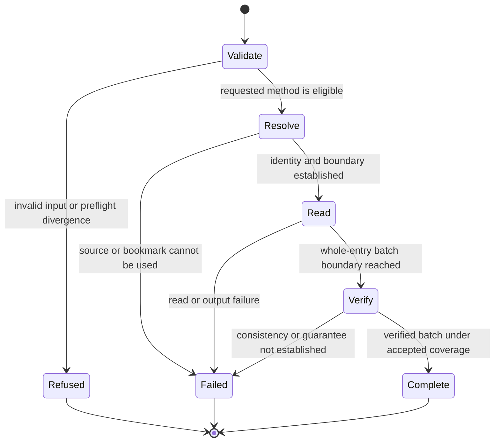

# RFC-03: Native transcript retrieval

## Abstract

HCN consumers need to inspect saved messages and tool results without asking a model to continue a conversation. This RFC adds passive native transcript reads through one JSONL CLI contract, with original records beside normalized fields. Reads cover one caller-identified native conversation, support verified caller-held bookmarks, and report each harness's actual coverage and limits. Consumers retain responsibility for indexing, retention, search, watching, and presentation. This document is a Draft and does not authorize implementation.

## Introduction

Trevor planning exposed a difference between native resume history and an inspectable transcript. The HCN checkout examined at the start of planning exposes resume and live-session operations but no unified saved-transcript read operation. Existing research found native read methods with different coverage: some return current model context or processed history, some expose retained entries, and some selected-version behavior remains unverified.

The [planning map](https://github.com/dungle-scrubs/harness-cli-normalizer/issues/154) records the decisions. Kevin confirmed the conversation, record, and incremental semantics through a live discussion, then instructed the driving session to take its remaining recommendations. The capability/ownership and custom-harness resolutions identify those machine-made choices. This RFC renders that contract into concrete wire fields and validation requirements under the same authority.

Native transcript retrieval belongs to HCN because it normalizes harness differences without maintaining cross-call application state. This adds a CLI capability within the normalization purpose in [CONTEXT.md](../../CONTEXT.md) and [ADR 0007](../adr/0007-narrow-scope-one-process-at-a-time.md). It does not add a supported library import surface.

In scope: Claude, Codex, Pi, and Muse source-specific capability reports; passive reads of one native conversation; native objects and normalized fields; retained branches; explicit coverage; bounded batches; bookmarks; and compatible customized Pi behavior. A method can report unknown or unavailable support rather than claiming parity.

Out of scope: discovering/listing conversations; HCN transcript storage or indexes; retention, search, watchers, retries, and acknowledgements across calls; human-readable exports; automatically reading external attachments or separate child/forked conversations; reconstructing deleted data; registering or integrating a new harness; and changing Trevor's ownership or harness choices. Model requests and changes to saved history are prohibited. RFC acceptance, implementation, release, and publication remain distinct steps.

## Terminology

The key words MUST, MUST NOT, REQUIRED, SHALL, SHALL NOT, SHOULD, SHOULD NOT, RECOMMENDED, MAY, and OPTIONAL in this document are to be interpreted as described in RFC 2119.

| Term | Meaning |
| --- | --- |
| Native conversation | A conversation identified by the harness. It can span several native files. It is distinct from HCN's live session process and a consumer's ID. |
| Retained history | Records still available in the native source, including retained branches and pre-compaction records. It is not a claim that everything originally said survived. |
| Current context | Messages currently prepared for the model. It can omit retained history. |
| Native entry | One entry in the selected native source. Headers that describe a file are source metadata. |
| Original record | The complete native entry object, with unknown fields and JSON values preserved. Exact whitespace and file formatting are not preserved. An API projection is labelled separately. |
| Source position | A record location scoped to an identified source and verified history. It is not a permanent native ID. |
| Bookmark | Opaque caller-held progress and validation evidence for a later read. HCN stores no associated cross-call state. |
| Batch | Whole native entries returned by one finite read, followed by a final result. |
| Coverage limit | A named retrieval guarantee that the caller explicitly permits the read to reduce. |
| Divergence | A capability the selected source/read method cannot express, reported instead of fabricated. Unknown evidence is distinct from known divergence. |
| Verified batch | A batch whose identity, prefix continuity when applicable, and source consistency pass the selected method's checks. |

## Protocol Overview

### CLI

The commands are:

```text
hcn inspect <harness> --transcript
hcn transcript read <harness> (--id <native-id> | --file <path>)
Optional arguments: --since <bookmark>, --limit <positive-entry-count>,
  --accept-limits <history,branches,original-records,embedded-content>
```

`<harness>` uses HCN's existing harness names. `--id` and `--file` are mutually exclusive and one is required for a read. IDs MUST be native conversation IDs, not HCN live-session handles or consumer IDs. A path MUST be validated as belonging to the selected native format. Resolution by ID MUST target that exact conversation; ambiguity or mismatch MUST fail. The operation MUST NOT fall through to creating or resuming a conversation.

Inspection prints one JSON object and exits. It MUST NOT open history or start a native process. `--transcript` MUST be exclusive with existing inspection modes whose output has a different meaning. Existing inspection output remains unchanged when this flag is absent.

A read writes JSONL to stdout without requiring `--json`. Saving stdout is the export operation. Diagnostics go to stderr, while results carry all fields needed by a machine consumer. Help/version requests retain ordinary CLI behavior. Prompt, model, tool-grant, extension, and native-passthrough arguments MUST NOT be accepted by the transcript reader. Run defaults MUST NOT cause a transcript command to launch model work or load user instructions.

`--limit` is an optional count of native entries, excluding the source and result envelopes. With no count, the call reads to its fixed verified boundary. The count does not impose a byte limit, allow truncation, or bound the internal work needed for validation. HCN MUST stop between native entries. Large entries MUST remain complete or produce an explicit failed batch.

### Selection and coverage

One read MUST include all files that the native format identifies as parts of the targeted conversation and that are needed for the requested coverage. Separate child or forked conversations MUST remain references. HCN MUST NOT interpret a single file as complete merely because it is readable; native segmented or paginated storage can need additional sources.

The default request is all retained history, retained branches, original saved records, and embedded content. Prefer a verified source that meets those guarantees. `--accept-limits` permits only the named reductions; there is no `all` value. Each actual reduction MUST be reported with its evidence and reason. An accepted limit MUST NOT be interpreted as an instruction to discard data that is safely available.

Historical loss already caused by the harness MUST be reported when known. Reading all currently retained records can complete successfully while historical completeness remains unknown or known to be reduced. No result may claim to recover data that is no longer retained.

Absent native IDs, unknown relationships or active-branch state, external attachment references, batching, and an unfinished tail follow their specific rules below. They are not silent waivers of retained-history coverage. Coverage opt-ins MUST NOT relax passive-read, integrity, value-preservation, or bookmark-validity requirements.

### Read sequence

1. Validate the invocation and descriptor evidence. Refuse known divergence or unverified passive behavior before starting the native read operation.
2. Resolve the source and verify identity, format, requested guarantees, and any bookmark. An unfamiliar writer/reader version alone is insufficient for refusal when compatibility can still be established.
3. Establish a finite read boundary and source-consistency method. Emit source details before transcript entries.
4. Return whole native entries in saved order, within the caller's count and verified boundary. Report any encountered limit or incomplete tail.
5. Verify the batch and emit its final result. Only a successful final result can carry an advancing bookmark.

For failures before source details are known, HCN MUST still emit a source envelope with unknown fields followed by a failed/refused result when the transcript command was recognized. If output itself is broken, the process exit is the only available completion signal and MUST be nonzero.

## Message Formats

### Common framing

The wire format is UTF-8 JSONL, with one JSON object per LF-terminated line. Every envelope has required `schemaVersion: 1` and `kind`. A normal stream has exactly one `source`, zero or more `record` envelopes, and one terminal `result`. No record can follow a result. Empty successful reads still include source and result envelopes.

Native JSON values MUST retain their values, including numeric precision. A JavaScript number conversion that changes an original integer is not compliant preservation. Unknown native fields MUST remain in `original`; JSON whitespace, key order, and escape spelling are not identity. Unknown protocol-envelope fields are additive and can be ignored by a schema-v1 consumer.

### Capability document

Inspection returns `schemaVersion`, `kind: "transcript-capabilities"`, `harness`, `hcnVersion`, `verifiedAgainst`, `sourceFormats`, `methods`, and `capabilities`. Each method identifies whether it reads files, a native API, or a native export process and records the evidence for its passive lifecycle.

`capabilities` contains independently reported entries for `retainedHistory`, `retainedBranches`, `activeBranch`, `originalRecords`, `embeddedContent`, `incremental`, `paging`, and `recordIdentity`. Every entry has `status` (`available`, `limited`, `unavailable`, or `unknown`), `reason`, and `evidence`. Evidence entries carry `standing` (`documented`, `observed`, or `unknown`), a source reference when known, and applicable versions/formats. Conditional prerequisites MUST be explicit. Incremental capability also states whether native incremental retrieval is available or whether earlier history must be reread. Record identity describes native IDs, source positions, or a mixture; it does not imply that all records have permanent IDs.

Descriptor evidence, compatibility with the selected version, and source-specific checks are separate facts. Inspection is not evidence that a particular path is readable. Source observations can reduce a descriptor claim and MUST NOT promote unrelated claims to verified.

### Source envelope

Required fields, with null permitted only where specified:

| Field | Contract |
| --- | --- |
| `schemaVersion`, `kind` | `1`, `"source"` |
| `harness`, `hcnVersion` | Chosen harness, or null before valid selection; emitting HCN version |
| `conversation` | Object with nullable `nativeId`, or null before identity is known |
| `sources` | Source descriptions with local key, source kind, known native identity/location, and format version. Keys are scoped source references, not invented native IDs. Empty before resolution. |
| `nativeHeaders` | Complete native file-header objects, each attached to its source key; empty when absent. Headers are not silently discarded or counted as conversation entries. |
| `method` | Selected read-method identifier, or null before selection |
| `versions` | Nullable recorded writer version, actual native reader version when used, and explicit verification versions; these MUST NOT substitute for each other |
| `requested`, `acceptedLimits` | Requested guarantee names and caller-accepted limit names |
| `coverage` | Per-guarantee `complete`, `limited`, `unknown`, or `not-applicable`, with reasons and evidence; provisional until result |

Source metadata identifies the actually selected source/method. `nativeHeaders` MUST preserve custom header fields as well as recognized identity fields. Preflight source metadata can be incomplete; the result MUST carry authoritative final coverage and branch/consistency observations.

### Transcript record

| Field | Contract |
| --- | --- |
| `schemaVersion`, `kind` | `1`, `"record"` |
| `nativeId` | Native entry ID as a string, or null. It MUST NOT be synthesized from content or position. |
| `position` | Source key, native location unit, and location value scoped to the verified source history. Numeric positions are decimal strings. A method unable to locate records must report that limitation rather than invent cross-read identity. |
| `originalKind` | `saved-record` or `api-record`; the latter is not proof of original saved-record coverage |
| `original` | Complete object from the selected native entry source |
| `normalized` | Recognized facts described below; unknown facts remain null or explicitly unknown |

There is one record per native entry. A message with text and two tool calls stays one entry with three parts. Native content MUST NOT be split into synthetic messages, and distinct native entries MUST NOT be merged because they look similar. If only a processed native API record is available, preserve that object and report the original-record coverage limit. The read MUST NOT label that projection as a saved record.

`normalized` contains `kind`, `role`, `timestamp`, `parts`, and `relationships`. Entry kinds are `message`, `tool-result`, `compaction`, `branch-summary`, `metadata`, `custom`, or `unknown`. Roles are `user`, `assistant`, `system`, `tool`, `custom`, or `unknown`, or null for non-message records. Timestamps are normalized only where native semantics establish their units and meaning. Original timestamp values remain available in the native object.

Parts preserve native content order. Each part has a recognized `kind` (`text`, `thinking`, `tool-call`, `tool-result`, `image`, `audio`, `video`, `file-reference`, `custom`, or `unknown`) and an `originalPath` locating its value inside `original`. The path is an array of object-key strings and array-index integers. Known text, tool-call IDs, and tool names SHOULD be exposed as normalized fields for consumption. Other payloads remain completely accessible through that path; it MUST resolve within the same record and MUST NOT trigger an external read. Unknown part data stays available without needing a custom renderer or extension.

Relationships identify facts such as a native parent entry, native tool call, first kept entry after compaction, branch origin, or parent conversation. Each relationship names its kind, target kind, target native ID or source position, and whether its basis is an explicit native field or a verified native-format rule. Targets MUST retain their native conversation/source scope. HCN MUST NOT match a result to the closest preceding tool call or infer summary input from prose. Missing relationships are unknown; known root/no-parent state is distinct from missing evidence. The original native object is authoritative for additional relationships not covered by the normalized vocabulary.

Embedded images and other content remain in the record. External file references have `contentStatus: "not-included"` when normalized, without claiming that the file exists or is accessible. HCN MUST NOT open those files automatically.

### Final result

| Field | Contract |
| --- | --- |
| `schemaVersion`, `kind` | `1`, `"result"` |
| `status` | `complete`, `refused`, or `failed`; complete describes this batch, not all historical coverage |
| `exitCode` | 0, 2, or 1 respectively, when stdout remains writable |
| `recordsReturned` | Nonnegative integer count of emitted native entries, including provisional entries before a failure |
| `coverage`, `limits` | Final per-guarantee coverage and actual named limits, with reasons and accepted/unaccepted status |
| `more` | Whether more complete entries remain within this call's boundary, or null if not established |
| `incompleteTail` | Null or a source position and reason for an unfinished native record |
| `activeBranch` | Known native selection/reference with evidence, or an explicit unknown state; not inferred from last saved entry |
| `consistency` | Method (`native-snapshot`, `validated-prefix`, or `unknown`), verified boundary/source facts, and any limits on the observation |
| `bookmark` | Opaque next bookmark or null. Failed/refused batches MUST use null. A successful source lacking verified continuation support also uses null and reports that capability. |
| `failure` | Null on success, otherwise the structured failure defined below |

For example, a synthetic empty successful read can end with `recordsReturned: 0` while `activeBranch` reports a selection change. A source that cannot reveal live branch state instead reports unknown. Neither zero entries nor EOF implies that the native conversation is finished.

### Bookmarks

Consumers MUST treat bookmark encoding as opaque. HCN MUST validate its version, method/format compatibility, conversation/source identity, progress boundary, and evidence for already-read history before using it. A token MUST contain or reference native stateless evidence sufficient for those checks; it MUST NOT depend on an HCN-owned registry, persistent index, or secret signing state. It MUST NOT embed transcript content or credentials. Tokens are not authorization grants: the read still requires normal source access.

For native methods, cursor acceptance is necessary where required but is not by itself proof that earlier records are unchanged. For file methods, a reader MAY validate the earlier prefix against caller-held fingerprints and source facts, rereading it when needed. Content hash alone is not record identity, and path/mtime/size alone MUST NOT be presented as proof of continuity. The specific native or file validation method MUST have conformance evidence for the consistency it claims. Where the source cannot support those checks, incremental capability remains unavailable or unknown.

No generated position token is permanent across incompatible rewrites. A moved source supplied by the caller can continue only when identity and prior history are verified. HCN MUST NOT search for replacement conversations automatically. Continuation across different read methods/formats is allowed only when an explicit compatibility rule establishes it; otherwise return fresh-read-required.

## State Machine



The final result MUST be emitted before assigning the normal exit code when output remains writable. There is no automatic retry, watcher, or model turn. In-call resources MUST be closed on completion, failure, or interruption.

Each call has a finite verified stopping point. Batching does not freeze a sequence of calls into one snapshot: a later call verifies its own boundary and earlier progress. Records appended after one call's boundary can appear in a later call. An appended compaction record is new data if prior history remains compatible; rewriting old records invokes the bookmark-validity rule.

After interruption, a consumer retries its previous bookmark if desired. Previously streamed records can repeat. A consumer MUST NOT treat an unsuccessful batch's bookmark as committed progress; no such bookmark is issued. How a consumer stores records and advances its own index is outside HCN.

An unfinished final native record can be excluded from an otherwise verified prefix batch. HCN MUST flag it and stop the bookmark before it. A later read can retry it. This exception does not permit skipping corrupt middle records and does not promise that a writer will finish the tail. If there are no newly completed entries, the successful result can retain the previous progress boundary while reporting the tail.

If concurrent changes prevent one consistent batch from being established, the operation MUST fail without an advancing bookmark. Records already sent remain provisional. `validated-prefix` reports the actual checks and source assumptions used; it MUST NOT be advertised as a stronger native snapshot or an atomic observation of unrelated live state. A source whose rewrite behavior cannot be checked cannot claim verified consistency.

## Error Handling

HCN MUST retain the 0/1/2 exit split and stable structured issue codes. Exit 2 is a known preflight refusal or invalid invocation; exit 1 is a failed read; exit 0 means the batch completed under the declared requested/accepted coverage. A successful limited batch still reports every limit. `more: true` and a flagged unfinished tail are not failures when the returned prefix is verified under the agreed rules.

`failure` has required `issue` and `message`, plus nullable `hint`, affected `guarantee`, `position`, and `nativeExitCode`. Hints SHOULD name a verified same-source alternative when one exists. There is no generic retryable boolean or automatic routing rule. Missing hints are preferable to an invented alternative. Consumers MUST NOT need to parse prose to determine the issue.

| Issue | Meaning and exit |
| --- | --- |
| Existing `invalid-option-value`, `mutually-exclusive-options`, and applicable CLI parse issues | Invalid selectors, limits, opt-ins, or bookmark encoding; 2 |
| `transcript-divergence` | Known requested capability cannot be provided before reading and no applicable limit was accepted; 2 |
| `transcript-unverified` | Evidence needed for the requested source/method guarantee is unknown at preflight; 2 |
| `passive-read-unverified` | No verified no-model/no-history-write lifecycle; 2; coverage opt-ins cannot waive it |
| `source-not-found` | Requested source or native conversation is missing; 1; never an empty successful read |
| `source-inaccessible` | Access denied, unavailable native access, or unreadable source; 1 |
| `source-malformed` | Invalid native structure, broken required framing, or corrupt middle record; 1; name position without leaking record content |
| `fresh-read-required` | Well-formed bookmark no longer applies or its continuity cannot be established; 1; no automatic restart |
| `source-changed` | Changes during the call prevent verification of a consistent batch; 1; a later retry must validate its old bookmark again |
| `guarantee-unmet` | A source-specific check during reading finds an unaccepted retrieval limit or another unmet requested guarantee; 1 |
| `native-read-failed` | A verified native reader failed; 1; preserve native exit information when available |
| `output-failed` | Output could not complete; 1; emit a failure result only if still possible |

A malformed middle record, inconsistent source, or access failure MUST NOT be converted to successful limited coverage. No coverage option can permit a model call, history mutation, invented data, silent loss, or an advancing bookmark over an unverified prefix. When a user can explicitly request a verified limited export, refusal metadata MUST name the limits; it MUST NOT perform that export automatically. Any records emitted before discovering an unaccepted limit belong to a failed batch.

## Security Considerations

Transcript content is untrusted data. HCN MUST NOT execute commands, load instructions/skills/extensions, follow prompt text, render active HTML, or dereference external URLs/files found in records. Native custom data remains data. Source paths and bookmarks MUST be validated against the selected native source and caller's ordinary filesystem permissions; a bookmark is not permission to read an arbitrary path.

Reads MUST make no model request and MUST leave saved history unchanged. A native process is eligible only when its exact relevant lifecycle is verified, including startup, source selection, migration, hooks/extensions, authentication behavior, and teardown. The transcript operation MUST NOT resume a turn or invoke authentication workflows. Current-context APIs that require unsafe initialization are ineligible even with accepted coverage limits.

Direct-file readers SHOULD be preferred when they preserve more native data and avoid runtime lifecycle effects. Read operations MUST NOT migrate, repair, lock by modifying native history, or initialize empty source files. Any temporary material needed during a call MUST remain local, private to the caller, and be removed on normal completion; it MUST NOT become cross-call HCN state. Native or filesystem snapshots can be used only when their acquisition itself meets the passive contract.

Original records can contain private data or credentials. The user deliberately sends them to stdout or an export file; HCN MUST NOT additionally log record bodies, raw bookmark tokens, or credentials to diagnostics, telemetry, or research artifacts. Error reports identify positions and error kinds. Verification for this feature MUST use public documentation/source and synthetic histories. Hosted models MUST NOT receive actual private transcripts as test inputs.

## Versioning

This is transcript schema version 1. The CLI read and inspect additions MUST NOT change existing run/session/inspection behavior or reuse model-turn event kinds with different semantics. Record bodies retain native formats alongside the versioned normalized contract.

Within schema version 1, added optional fields are compatible. Changes to required-field meaning, framing, closed normalized kinds, failure-code meaning, or bookmark semantics require explicit compatibility treatment and, where incompatible, a new schema/bookmark version. Consumers MUST fail clearly on an unknown schema major version; they may ignore unknown native fields while preserving them.

HCN's descriptor `verifiedAgainst` remains the harness-version evidence anchor. Do not bump it merely to label this feature as implemented. Transcript method/format evidence MUST remain separately attributable. Verification of one method does not imply verification of every operation in the harness descriptor.

Customized Pi qualifies through preserved source/protocol semantics and tested passive behavior. Compatible extension records can remain unknown to normalization without being dropped. Changed formats or lifecycle behavior require new evidence; using Pi's SDK or copying a stock version string is insufficient. A separate SDK-based harness remains a separate future integration. This RFC creates no runtime harness-registration or arbitrary-reader-command interface.

## Implementation Notes

### Layers and enablement

Keep transcript facts and closed vocabularies in pure immutable knowledge. Keep source-record interpretation, capability evaluation, relationships, bookmark encoding/validation over supplied facts, and output projection pure. Execution owns filesystem/native-process I/O and in-call lifecycle through injected primitives, with Node/Bun parity. The CLI is the supported surface; consumers MUST NOT need internal HCN imports. Existing purity and no-consumer-chat-import gates remain intact.

The selected-version evidence is deliberately uneven:

| Harness | Evidence informing the implementation | Enablement gate |
| --- | --- | --- |
| Pi 0.84.2 | Retained entries and strict-after cursors are source-verified. Ordinary session opening can migrate/write; file-only reads cannot observe every live leaf move. | Start with a passive file reader; prove each claimed format, branch, original-record, and continuation guarantee on synthetic inputs. |
| Claude 2.1.233 | Matched SDK 0.3.233 passed a bounded passive synthetic read probe, but its view filters native data and some large-file pre-compaction history. | Verify fuller source reading or explicitly report the accepted limits of the selected method; do not label the SDK view as complete originals. |
| Codex 0.147.0 | Read APIs and paging exist, but processed views omit/transform retained records; storage can span segments and a loaded read can persist data. | Prove identity, source coverage, and passive behavior for each supported legacy/segmented method. Unverified storage modes remain explicit divergence/unknown. |
| Muse 0.1.0 | Current Meta docs describe export, but selected-version semantics and passive behavior are unverified. | Obtain version-identifiable evidence and synthetic proof before enabling a reader. Otherwise ship truthful unknown/divergence reporting and leave retrieval disabled. |

A passing shared contract test does not substitute for native-method evidence. Likewise, one source format does not establish all versions, custom builds, or live-process behavior. Tests MUST cover source identity, missing native IDs, original numeric/unknown-field preservation, multi-part tools, compaction, branches, scoped positions, opt-ins, access errors, and completion framing.

Incremental conformance MUST cover repeated reads, duplicate identical messages, surviving anchors after earlier edits, same-size changes, truncation, replacement, moves, incompatible formats, active branch changes without new records, incomplete tails, and rewrites during reading. Each method MUST either satisfy the contract or report its limit; no test may quietly replace a failed guarantee with a narrower claim.

### Delivery and validation

The ticket set begins with RFC review/acceptance, then a complete Pi read plus inspection and refusal behavior. Pi batching/continuation is a separate complete slice. Claude, Codex, and Muse each have an independent versioned-evidence/read slice. Customized Pi conformance and final consumer-facing verification follow the applicable shared behavior. Each reader's claims are enabled only after its scoped tests pass.

Every HCN change MUST audit/update the HCN usage skill in the shared skill source as required by repository guidance. The final handoff includes transcript command examples, capabilities and coverage, original records and references, bookmarks and retries, corruption/unfinished-tail distinctions, and no-model/no-history-write limits. Run the skill's `check-claims.sh` against the updated binary and `check-claims.test.sh` before completion. Implementation uses the repository's dual-runtime checks; this Draft contains no implementation and claims no full-suite run for new behavior.

Rollback is disabling a reader/capability claim or reverting the additive CLI feature. No native transcript migration or HCN-owned store requires rollback. Publishing a package or changing consumers' dependencies is outside these tickets unless separately authorized.

## Open Questions

1. **RFC acceptance.** The decisions and recommended concrete schema are ready for review, but the RFC remains Draft. Kevin or an authorized reviewer decides whether to move it to Accepted. Review findings can amend this Draft before implementation.
2. **Selected reader evidence.** Method-specific runtime checks remain implementation acceptance gates, especially for active sources, paginated Codex storage, legacy Pi formats, and Muse 0.1.0. The choice is already made: enable only established capabilities and report the others explicitly. A proposed guarantee reduction beyond the named opt-ins requires revisiting this RFC, not silently weakening a test.

Machine-made choices under Kevin's explicit delegation include the protocol RFC type, the concrete field/issue vocabulary, inspection and opt-in spelling, per-capability evidence reporting, corruption handling, custom-build conformance, and the ticket slicing. They preserve the previously confirmed semantics. No unresolved Trevor ownership decision is answered here.

## References

### Normative

- [HCN domain and scope](../../CONTEXT.md) and [repository instructions](../../AGENTS.md) - the supported CLI surface and layer invariants.
- [ADR 0007](../adr/0007-narrow-scope-one-process-at-a-time.md) - cross-process ownership boundary.
- [ADR 0002](../adr/0002-structured-refusal-with-hint.md) - structured hints and evidence-based alternatives.
- [Conversation identity and records](https://github.com/dungle-scrubs/harness-cli-normalizer/issues/157#issuecomment-5631704764) - human-confirmed record semantics.
- [Incremental reads](https://github.com/dungle-scrubs/harness-cli-normalizer/issues/158#issuecomment-5633263338) - human-confirmed bookmark and consistency semantics.
- [Capabilities and ownership](https://github.com/dungle-scrubs/harness-cli-normalizer/issues/159#issuecomment-5634252123) - remaining recommendations taken under delegation.
- [Custom and new harness requirements](https://github.com/dungle-scrubs/harness-cli-normalizer/issues/160#issuecomment-5634283881) - compatibility and conformance requirements.

### Informative

- [Planning map](https://github.com/dungle-scrubs/harness-cli-normalizer/issues/154) - decision index and handoff.
- [Claude/Codex research](https://github.com/dungle-scrubs/harness-cli-normalizer/blob/a7c40bd308895a796a5a7956221a83bcc8dae916/research/transcripts/claude-codex.md) - versioned findings, probe, and source citations.
- [Pi/Muse research](https://github.com/dungle-scrubs/harness-cli-normalizer/blob/7fb91e1c06fa950d0812d6c57f52fc6ead1b84fe/research/transcripts/pi-muse.md) - versioned findings and runtime gaps.
- [Related startup/history protection decision](https://github.com/dungle-scrubs/harness-cli-normalizer/issues/149) - existing work to preserve while integrating.
- Trevor's existing local research at `/Users/kevin/dev/trevor/.scratch/assistant-architecture/research/hcn.md` and planning map at `/Users/kevin/dev/trevor/.scratch/assistant-architecture/map.md` - motivation and separate ownership discussion; reference these instead of copying their contents.
